# Healthcare Management Platform - Flow Chart

## 🏥 System Architecture Flow

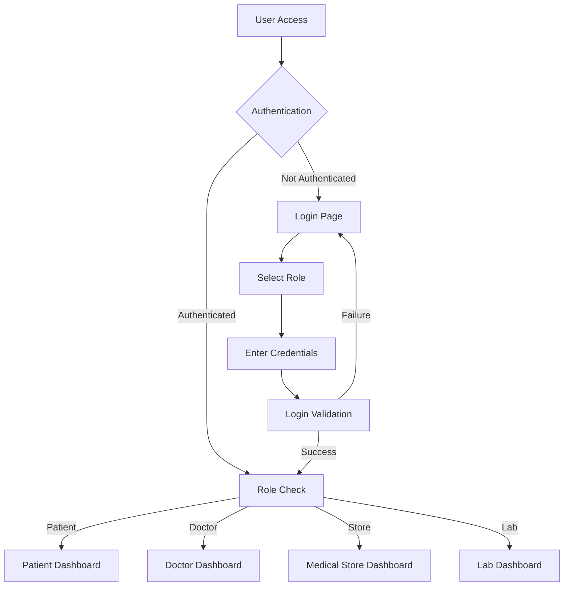

## 🧑‍⚕️ Patient Journey Flow

```mermaid
graph TD
    A[Patient Login] --> B[Patient Dashboard]
    B --> C{Select Tab}
    
    C -->|Overview| D[View Health Summary]
    D --> D1[Next Checkup Date]
    D --> D2[Active Medicines]
    D --> D3[Recent Reports]
    
    C -->|Health History| E[View Medical Records]
    E --> E1[Toggle Doctor Access]
    E --> E2[View Reports]
    E --> E3[Download Reports]
    
    C -->|Medicines| F[Prescription Management]
    F --> F1[View Active Medicines]
    F --> F2[Medicine Reminders]
    F --> F3[Dosage Information]
    
    C -->|Appointments| G[Appointment Timeline]
    G --> G1[Upcoming Appointments]
    G --> G2[Past Appointments]
    G --> G3[Appointment Reminders]
    
    C -->|Medical Stores| H[Store Search]
    H --> H1[Search by Medicine]
    H --> H2[Compare Prices]
    H --> H3[Check Stock]
    H --> H4[View Store Location]
    
    C -->|Labs| I[Lab Search]
    I --> I1[Search by Test]
    I --> I2[Compare Prices]
    I --> I3[Check Availability]
    I --> I4[View Lab Location]
    
    C -->|Doctors| J[Doctor Recommendations]
    J --> J1[Search by Specialty]
    J --> J2[View Ratings]
    J --> J3[Check Availability]
    J --> J4[Book Appointment]
    
    C -->|Notifications| K[Notification Center]
    K --> K1[Medicine Reminders]
    K --> K2[Appointment Alerts]
    K --> K3[Checkup Reminders]
```

## 👨‍⚕️ Doctor Journey Flow

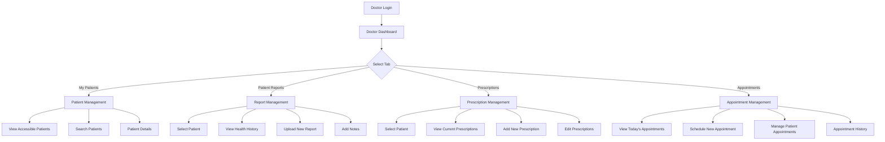

## 🏪 Medical Store Journey Flow

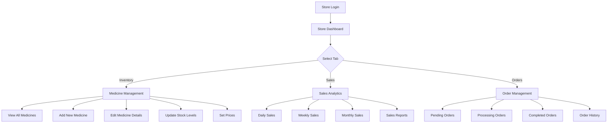

## 🧪 Lab Journey Flow

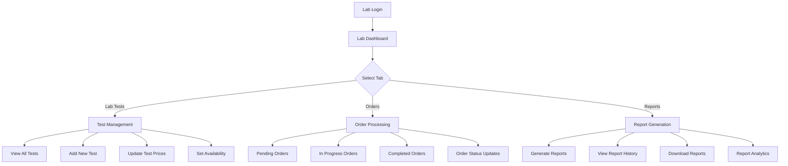

## 🔐 Authentication & Authorization Flow

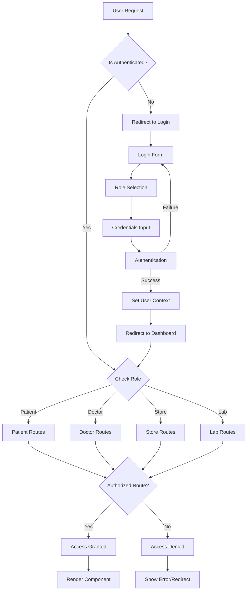

## 📱 Data Flow Architecture

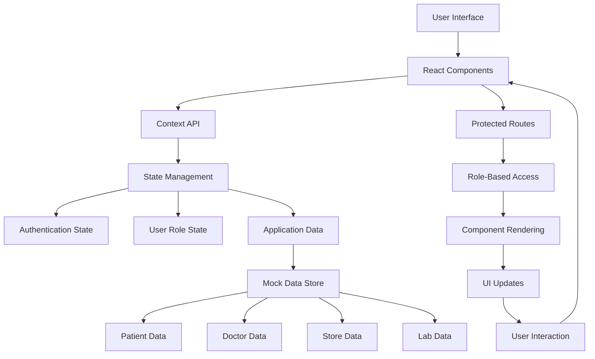

## 🔄 Patient-Doctor Interaction Flow

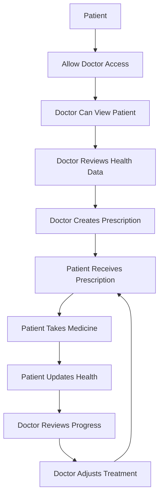

## 🛒 Patient-Store Interaction Flow

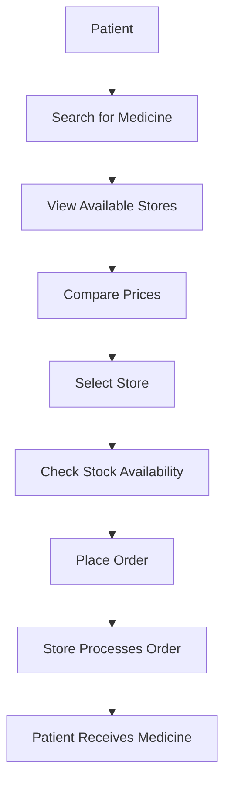

## 🧪 Patient-Lab Interaction Flow

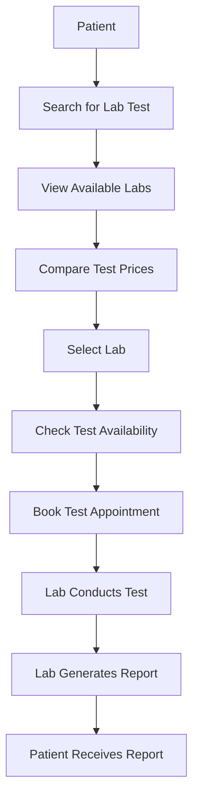

## 📊 Notification System Flow

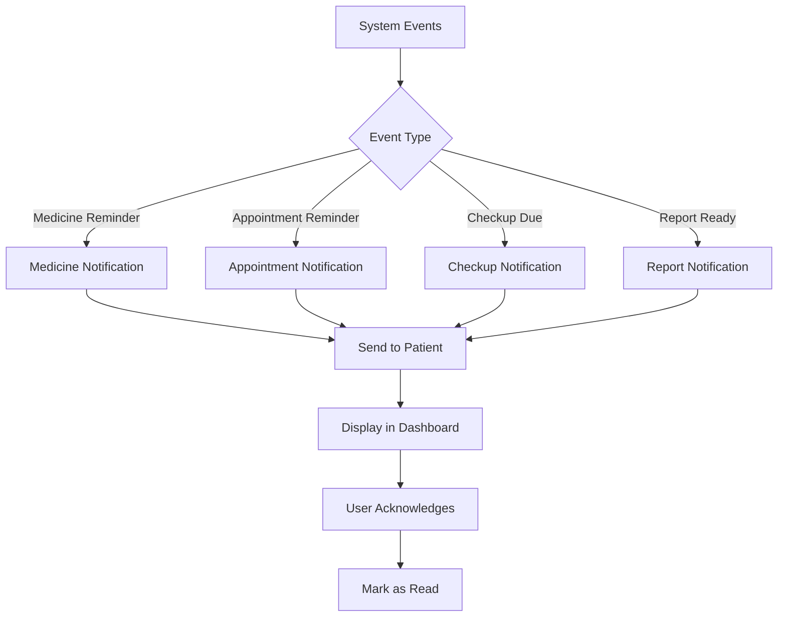

## 🔒 Privacy & Security Flow

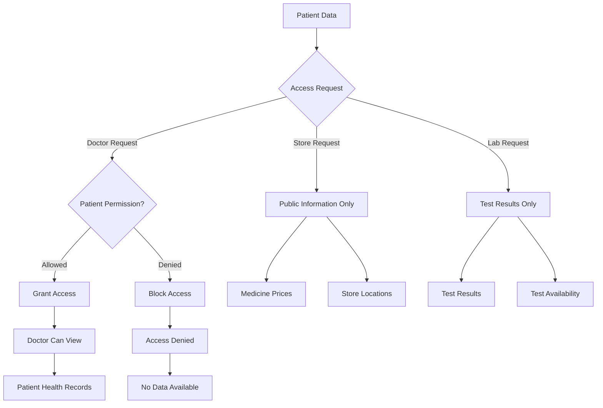

## 🎯 Key Features Summary

### Patient Features:
- Health history management
- Medicine tracking with reminders
- Appointment scheduling
- Store and lab search
- Doctor recommendations
- Privacy controls

### Doctor Features:
- Patient management
- Prescription creation
- Report review
- Appointment scheduling
- Treatment planning

### Store Features:
- Inventory management
- Order processing
- Sales analytics
- Price management

### Lab Features:
- Test management
- Order processing
- Report generation
- Availability tracking

This flow chart demonstrates the comprehensive nature of the healthcare platform, showing how different user roles interact with each other and the system to provide a complete healthcare management solution. 